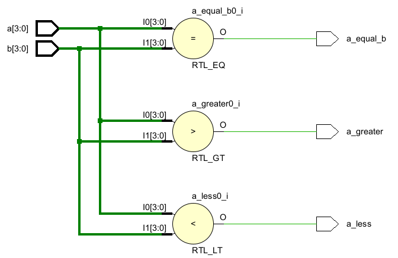
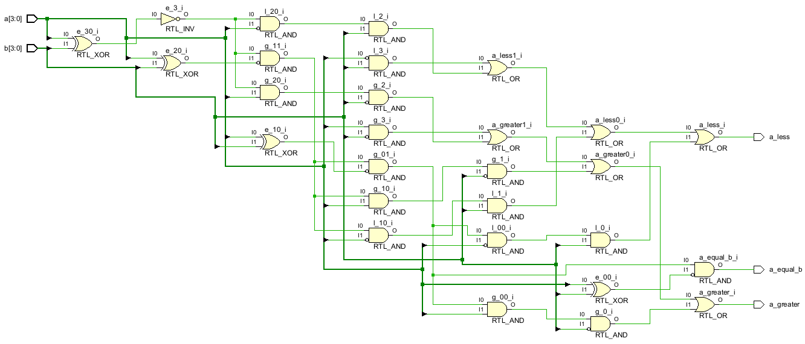
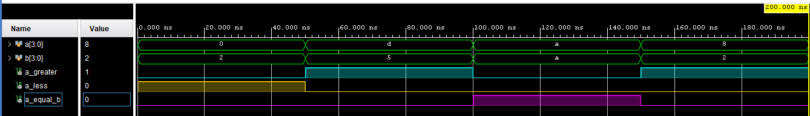

# 4-bit Comparator

This project implements a **4-bit digital comparator** in Verilog using both:  
- Behavioral Modeling  
- Structural (Gate-Level) Modeling  

---

## 🧠 Project Description

A **comparator** is a combinational circuit that compares two binary numbers and produces outputs indicating whether one number is **greater than**, **less than**, or **equal to** the other.

In this case:
- **4-bit inputs** → `a[3:0]` and `b[3:0]`  
- **3 outputs** →  
  - `a_greater` → High if a > b  
  - `a_less` → High if a < b  
  - `a_equal_b` → High if a == b  

---

## 📦 Models Implemented

### 🔹 1. Behavioral Model

This version uses conditional operators (`>`, `<`, `==`) to describe comparison logic.

---

### 🔹 2. Structural Model (Gate-Level)

This version uses basic logic gates (`and`, `or`, `not`, `xor`) to build the comparator structurally.

---

## 📊 Timing diagram of 4-bit Comparator

This diagram showcases the output behavior for all possible comparisons between `a` and `b`.

