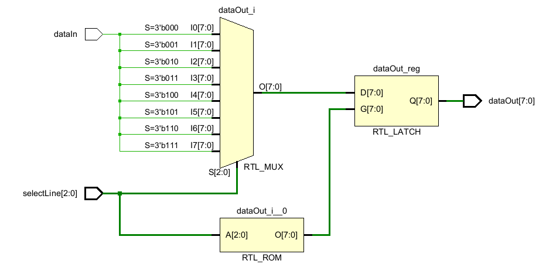
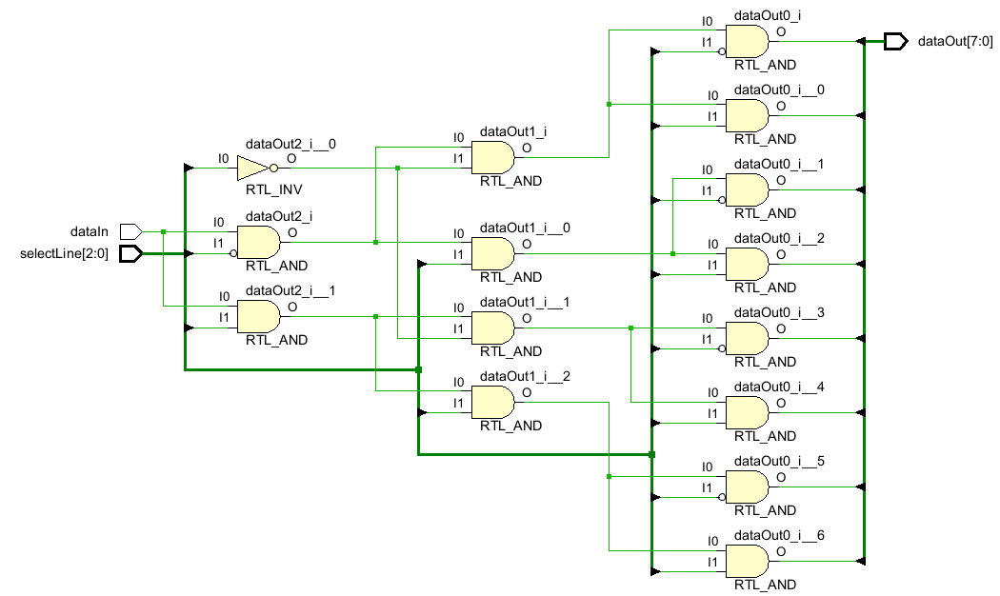
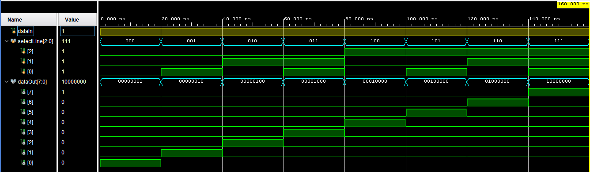

# 1×8 Demultiplexer (DEMUX)

This project implements a **1-to-8 demultiplexer** in Verilog using both:
- Behavioral Modeling
- Structural (Gate-Level) Modeling

---

## 🧠 Project Description

A demultiplexer (DEMUX) is a combinational circuit that takes a **single input** and routes it to one of several **output lines** based on control signals called **select lines**.

In this case:
- **1 data input** → `dataIn`
- **3 select lines** → `selectLine[2:0]`
- **8 outputs** → `dataOut[7:0]`

---

## 📦 Models Implemented

### 🔹 1. Behavioral Model

This version uses `case` statements to describe DEMUX behavior.

---

### 🔹 2. Structural Model (Gate-Level)

This version uses basic logic gates (`and`, `not`) to build the DEMUX using gate-level modeling.

---

## 📁 File Structure

---

## ⏱️ Timing Diagram

The timing diagram below illustrates how `dataIn` is routed to the appropriate `dataOut` line depending on the `selectLine` value.

---