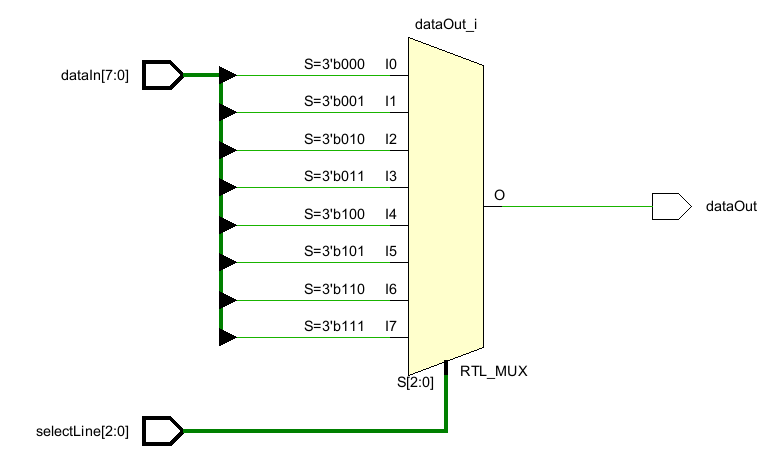
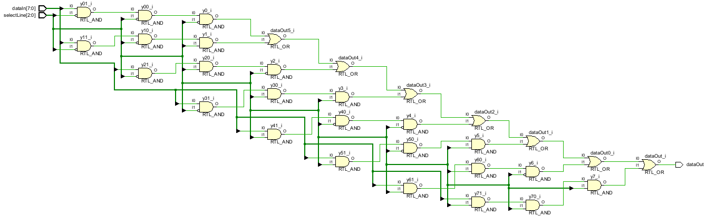

# 8x1 Multiplexer (MUX)

This project implements an **8-to-1 multiplexer** in Verilog using both:
- Behavioral Modeling
- Structural (Gate-Level) Modeling

---

## 🧠 Project Description

A multiplexer (MUX) is a combinational circuit that selects one of **many inputs** and forwards the selected input to a **single output line** based on control signals called **select lines**.

In this case:
- **8 data inputs** → `dataIn[7:0]`
- **3 select lines** → `selectLine[2:0]`
- **1 output** → `dataOut`

---

## 📦 Models Implemented

### 🔹 1. Behavioral Model

This version uses `case` statements or conditional assignments to describe MUX behavior.

---

### 🔹 2. Structural Model (Gate-Level)

This version uses basic logic gates (`and`, `or`, `not`) to build the MUX using gate-level modeling.

---